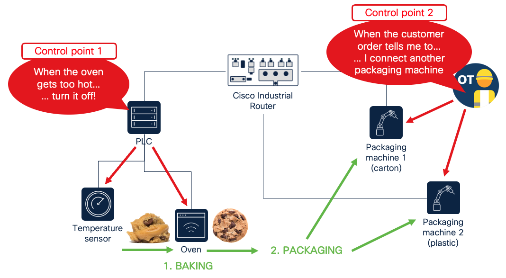

# Module 0: Set up a simulated factory floor as your playground for programming

In this module, you will set up a testing environment for programming in an industrial network. Concretely, this module includes a set of Docker containers each fulfilling a role in the following cookie factory floor:



## Set-up

0. Make sure you have [Docker](https://www.docker.com/products/docker-desktop/) installed.

1. Clone this repository

```
$ git clone https://github.com/Stienvdh/brkiot1073-cookie-factory
```

2. Switch to this folder in your terminal.

```
$ cd 00-cookiefactory
```

3. Run the playground environment using the commands in `docker_start.sh`

```
$ source ./docker_start.sh # For MacOS, or per command inside on a Linux environment
```

> [!NOTE]  
> You can run this playground without any networking equipment/real temperature sensors available. If you do have a temperature sensor available, you can set its IP address in `temperature/main.py` on line 7 as the `<address-of-your-temperature-sensor>` variable.

## Instructions

In a browser, navigate to `http://localhost` and see the different devices:
- Packaging machine 1 (carton) at `http://localhost:8001`
- Packaging machine 2 (plastic) at `http://localhost:8002`
- The PLC at `http://localhost:8003`
- The temperature sensor at `http://localhost:8004`
- The oven at `http://localhost:8005`
- A SCADA (monitoring) system at `http://localhost:8006` (This will be referenced in Module 4 of this repository)