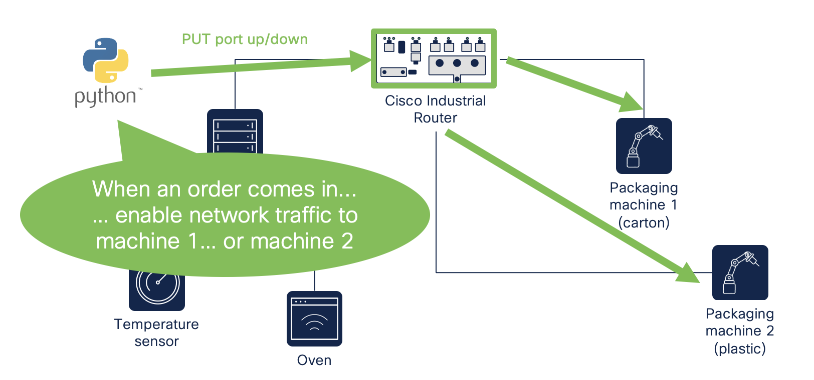

# Module 2: Use device-level APIs to have your industrial network make industrial processes more efficient

In this module, you will use device-level APIs to manage your network device. Specifically, you will learn how to turn specific network ports on or off. This could for instance be interesting when in some processes you need specific machines involved, while others should not be involved. 



## Set-up

1. Switch to this folder in your terminal.

```
$ cd 02-restconf
```

2. Install the Python libraries required.

```
$ pip3 install -r requirements.txt
```

3. Fill out the `.env` file with your device's variables.

```
DEVICE_IP=<your-device-ip> # Make sure this IP is reachable by the device executing these scripts!
USERNAME=<your-device-username>
PASSWORD=<your-device-password>
```

## Instructions

1. In one terminal, run the `get_ports.py` script. Every 2 seconds, it will print out the status of your device's LAN networking ports. You can use this terminal to easily monitor the effects of the next 2 scripts we will run.

```
$ python3 get_vlans.py
```

2. In another terminal, run the `turn_port_off.py` script. This will use device-level APIs to turn off port `FastEthernet0/0/1` on your network device. *NOTE: Adjust this variable accordingly if you want to use other networking ports on your device.*

```
$ python3 turn_port_off.py
```

3. Now run the `turn_port_on.py` script to turn the port you just disabled back on.

```
$ python3 turn_port_on.py
```