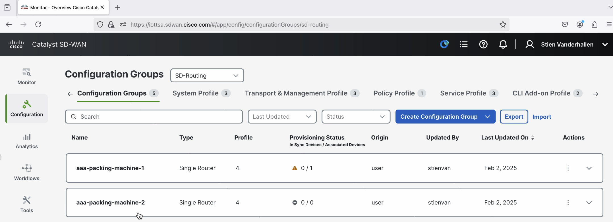
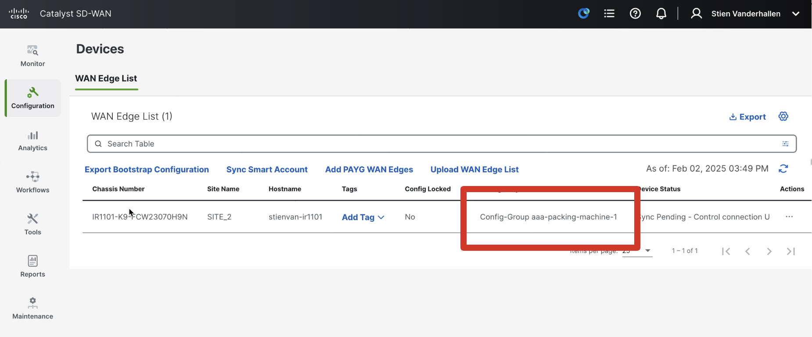
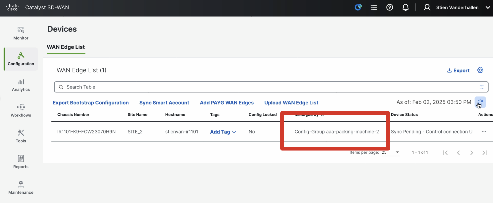

# Module 3: Use controller-level APIs to SCALABLY have your industrial network make industrial processes more efficient.

In this module, you will use Cisco Catalyst WAN Manager (formerly vManage) APIs to make the management of your network more friendly to a process-focused OT persona. Specifically, you will learn how to easily push an entire network configuration with just one script. This could for instance be interesting when you want to simplify industrial networking operations for your OT staff on your factory floor. This extends the following process we already followed in Module 2 to allow for more extensive configuration to be pushed as part of an entire configuration group.

## Set-up

1. Switch to this folder in your terminal.

```
$ cd 03-sdwan
```

2. Install the Python libraries required.

```
$ pip3 install -r requirements.txt
```

3. Fill out the `.env` file with your device's variables. 

```
VMANAGE_URL=<your-vmanage-ip>
VMANAGE_USER=<your-vmanage-username>
VMANAGE_PASS=<your-vmanage-password>
VMANAGE_DEVICE=<your-vmanage-device-name>
```

4. In Catalyst WAN Manager, configure 2 configuration groups: one named `aaa-packing-machine-1` with the network configuration for when packaging machine 1 is connected, and one named `aaa-packing-machine-2` with the network configuration for when packaging machine 2 is connected.



## Instructions

0. Depending on which configuration group you want to push, enable either line 67 (`aaa-packing-machine-1`) or line 68 (`aaa-packing-machine-2`) in the `main.py` script.

1. In a terminal, run the `main.py` script. 

```
$ python3 main.py
```

2. In Catalyst WAN Manager, you will see the configuration group of your device change to either `aaa-packing-machine-1` or `aaa-packing-machine-2`, depending on the line you selected in step 0 of this subsection. 




