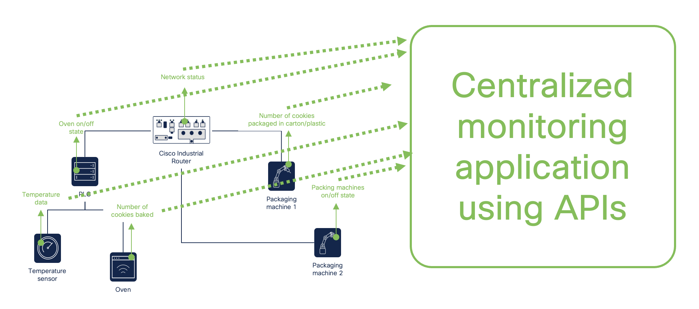
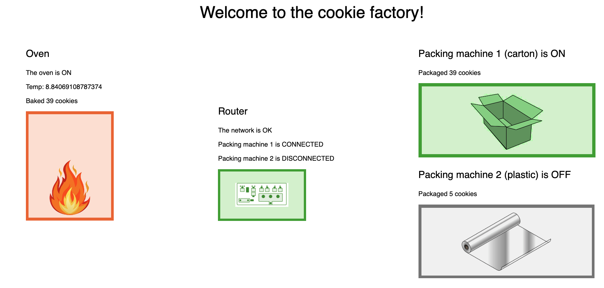

# Module 4: Use APIs to monitor your operations as YOU want to.

In this module, you will get a kickstart to building your own applications for monitoring your industrial processes exactly like you, and your OT staff, wants to. As a starting point, we will take a look at the cookie factory we built in Module 0.

## Set-up

Navigate back to Module 0 and make sure you have the cookie factory simulation running.

## Instructions

1. In a browser, navigate to `http://localhost:8006` and monitor the entire factory floor. 

2. **Now it's up to you!** How could you improve this, or make it more interesting to different personas? How can you change the cookie factory to be closer to your own, real industrial processes? The sky is the limit!

